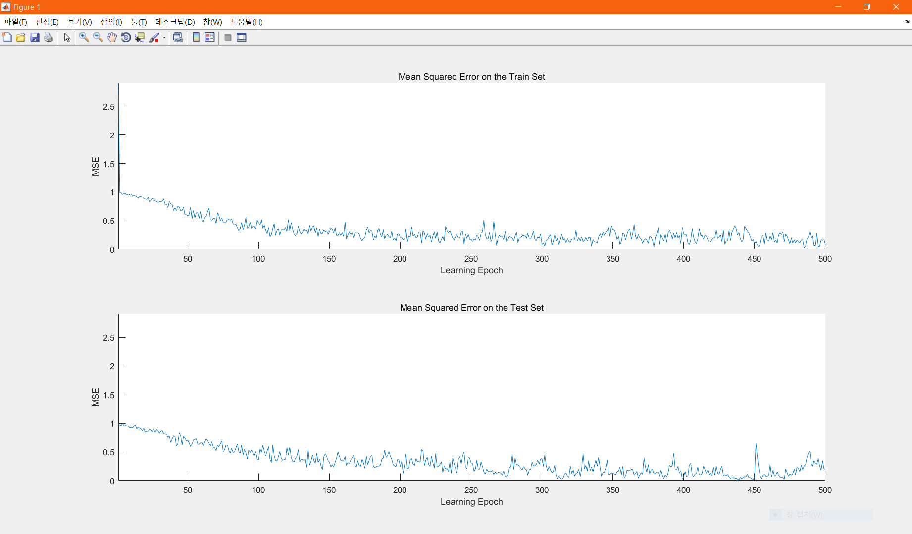
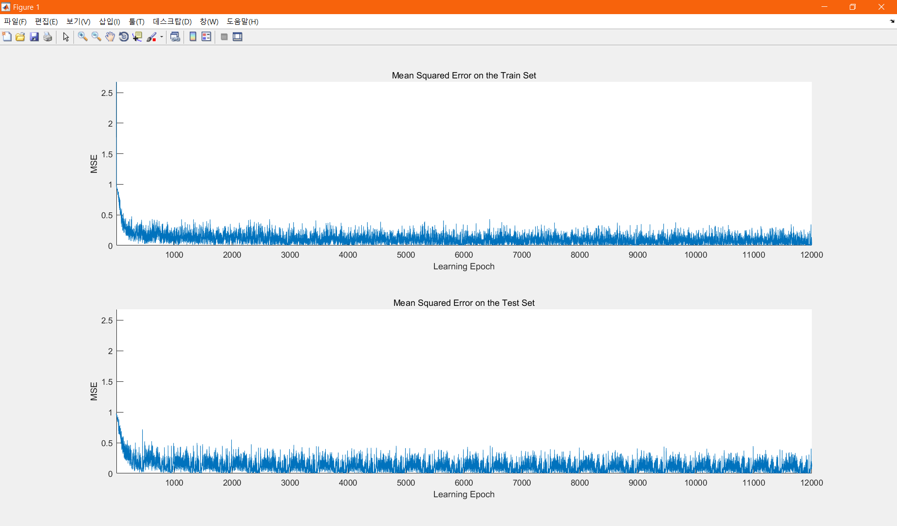

# Basic-MLP

## 개요
- 2017학년도 4학년 1학기 `인공지능` 수업 과제
- 역전파 알고리즘(EBP)을 이용하여 필기체 숫자 이미지의 학습과 인식을 수행하는 인공신경망 구현
- 입력 은닉 출력의 3층 MLP 네트워크 구성
- `MATLAB R2016a` 이용

## 요구사항
- MLP로 MNIST 데이터를 [Training & Test] 수행한다.
- (MNIST 데이터셋은 60,000개 학습 패턴, 10,000개의 테스트 패턴을 제공함)
- 에러율 그래프와 최종 에러를 결과로 출력한다.

## 실행화면

